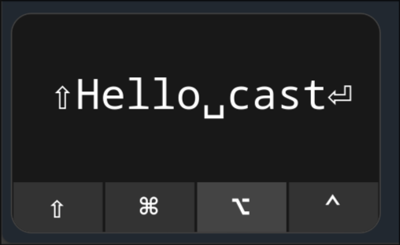

# Keycaster AGS

A key display utility I built while learning `astal`, `ags`, and `gtk`.  
It can be run on Linux (tested on Wayland) and is built with:

- [Astal](https://github.com/aylur/astal), a JavaScript framework for creating GNOME Shell extensions and widgets.
- [AlynxZhou/showmethekey](https://github.com/AlynxZhou/showmethekey), which provides key event listening functionality.



## Overview

Keycaster AGS is a keyboard and mouse input visualizer for Linux desktops. It displays key presses and mouse clicks on screen in real-time, making it perfect for:

- Recording tutorials and demonstrations
- Live streaming
- Presentations where viewers need to see your keyboard inputs

## Features

- Display keyboard inputs with proper symbols (⇧, ⌘, ⌥, ⌃)
- Show shifted key symbols
- Configurable mouse button action display
- Auto-clearing of displayed keys after configurable timeout
- Pause/resume functionality

## Installation

### Prerequisites

- [Astal](https://github.com/aylur/astal) framework
- [AlynxZhou/showmethekey](https://github.com/AlynxZhou/showmethekey) for key event listening.

### Steps

1. Clone the repository:

   ```bash
   git clone https://github.com/yourusername/keycaster-ags.git
   cd keycaster-ags
   ```

2. Initialize the project with Astal:

   ```bash
   ags init --gtk 4
   ```

3. Run the application:

   ```bash
   ags run ./main.tsx --gtk4
   ```

   For development mode:

   ```bash
   npm run dev
   ```

## Configuration

Configuration is managed through the `AppConfig` object in `lib/app/state.ts`:

```typescript
export const AppConfig = {
  // Show or hide mouse clicks
  showMouseAction: true,

  // Time in milliseconds before clearing displayed keys
  timeout: 500,
};
```

You can modify these settings to customize the behavior according to your preferences.

## Usage

You can pause or resume the display of key events using the following commands:

```bash
astral -i keycaster-ags toggle
# or
ags run ./main.tsx -a --toggle
```

## Project Structure

- `lib/app/state.ts`: Application configuration and state management
- `lib/visualizer/`: Core visualization components
  - `svelte/visualizer.ts`: Main visualization logic
- `lib/input-manager/`: Input event handling and key mapping
- `lib/utils/`: Utility functions

## Contributing

Contributions are welcome! Please feel free to submit issues or pull requests.

1. Fork the repository
2. Create your feature branch (`git checkout -b feature/amazing-feature`)
3. Commit your changes (`git commit -m 'Add some amazing feature'`)
4. Push to the branch (`git push origin feature/amazing-feature`)
5. Open a Pull Request

## License

This project is licensed under the MIT License - see the LICENSE file for details.

## Acknowledgments

- [Astal](https://github.com/aylur/astal) framework for providing the underlying infrastructure
- [ShowMeTheKey](https://github.com/AlynxZhou/showmethekey) for the key event listening functionality
- Inspiration from other key visualizers like KeyCastr for macOS
